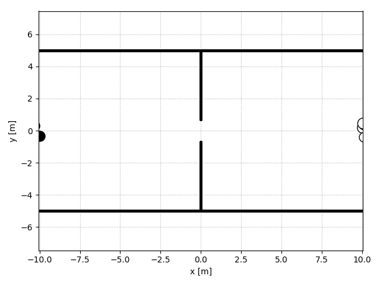

[](https://travis-ci.org/svenkreiss/socialforce)


# Social Force Model

```
    citation coming soon ...
```


# Install and Run

```sh
# install from PyPI
pip install 'socialforce[test,plot]'

# or install from source
pip install -e '.[test,plot]'

# run linting and tests
pylint socialforce
pytest tests/*.py

# plots of simulations
pytest -s tests/scenarios_*.py

# run fits and create plots
pytest -s tests/fit_pedped.py::test_opposing_mlp
pytest -s tests/fit_pedped.py::test_circle_mlp
```


# Ped-Ped-Space Scenarios




Emergent lane forming behavior with 30 and 60 pedestrians:


# Ped-Ped Scenarios

Crossing:


Opposing:


